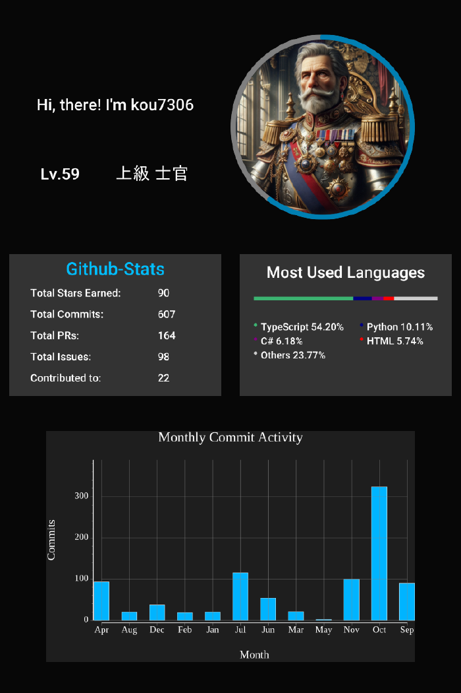

# GitHub Persona


## 生成例



## GitHub Persona Image

View your GitHub Persona Image on this page:

https://github-persona-i4wyybtla-kous-projects-7736bb57.vercel.app

To display it in your markdown, simply copy and paste the following code. Remember to replace `<your username>` with your actual GitHub username.

```

```

#### Example


## Contributing

For information on setting up a development environment, see [CONTRIBUTING.md](./CONTRIBUTING.md).
